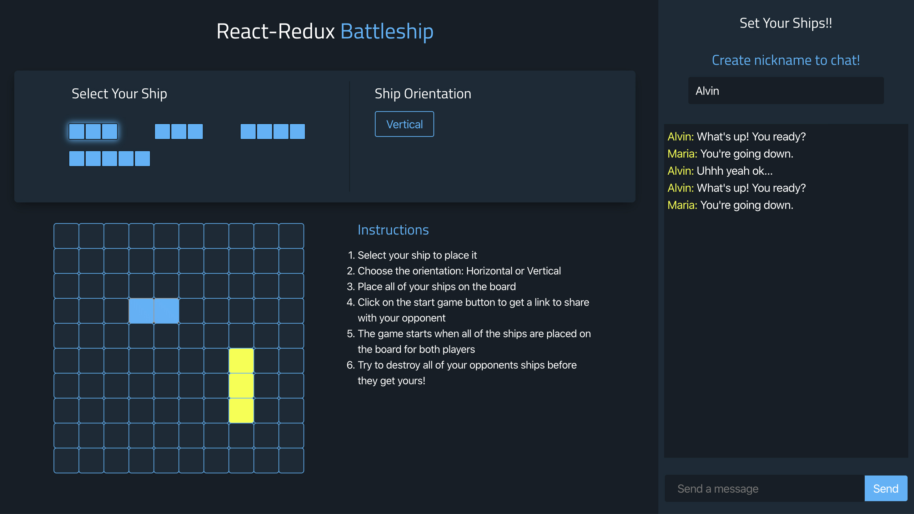
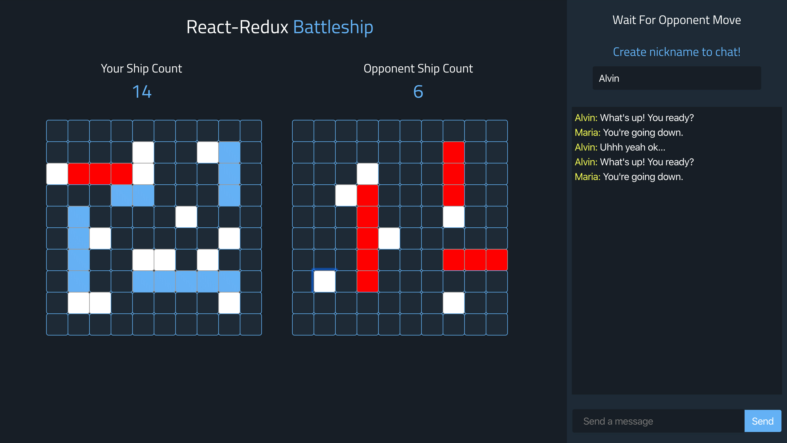

# Battleship

React application utilizing Redux.

# Start Game
- `npm install`
- `npm start`

# Technologies
- Firebase Realtime Database
- React/Redux
- Redux-Sagas
- Express
- Socket.io

# Game Initialization
- **Player 1** visits app (OPTIONAL: session is created for first time visitor)
- **Player 1** and **Player 2** initial state is saved to the database and a unique key is generated for the game
- **Player 1** is then supplied a URL that corresponds to the unique key in the database and is prompted to share the URL with **Player 2**
~~~~
playerOneReady: true,
playerTwoReady: false
~~~~
- **Player 1** is shown a waiting screen and waits until **Player 2** connects
- **Player 2** connects to the game, **Player 1** recieves notification that opponent has connected
~~~~
playerOneReady: true,
playerTwoReady: true
~~~~
- **Player 1** and **Player 2** is connected and ready
- **Player 1** and **Player 2** is prompted to place their ships on the board
- **GAME CANNOT START UNTIL BOTH PLAYERS HAS SET THEIR SHIPS**
- As **Player 1** and **Player 2** set their ships, actions are set to update the database with where they placed their ships
~~~~
key: '0A',
ship: true,
color: false
~~~~
- Once each player fills 17/100 squares with ships, then game is ready to start
- At this point, the state saved on the database should look something like this:
~~~~
key: 'OA',
ship: true || false,
color: false
~~~~
PLAYER ONE
state.active
false = has not clicked a ship
true = clicked a ship to place

state.ship
updates with the selected ship to place

Once player one places their last ship
state.player1Ready = true
state.active = false

PLAYER TWO
Once P2 sets last ship
state.player2Ready = true
state.active2 = false
state.isPlaying = true

Special thanks to @amangona
